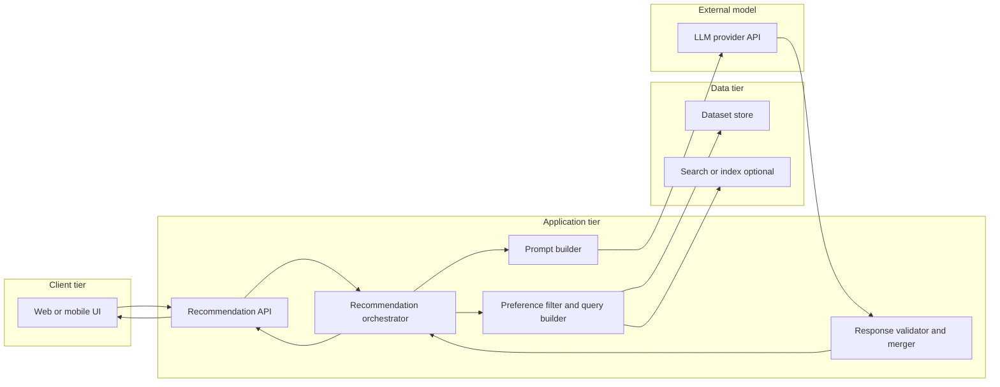
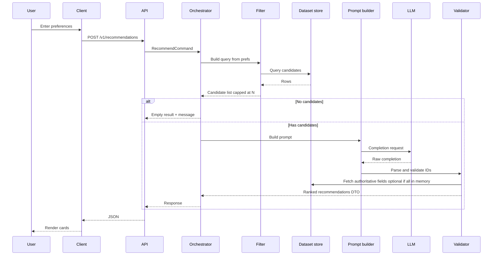
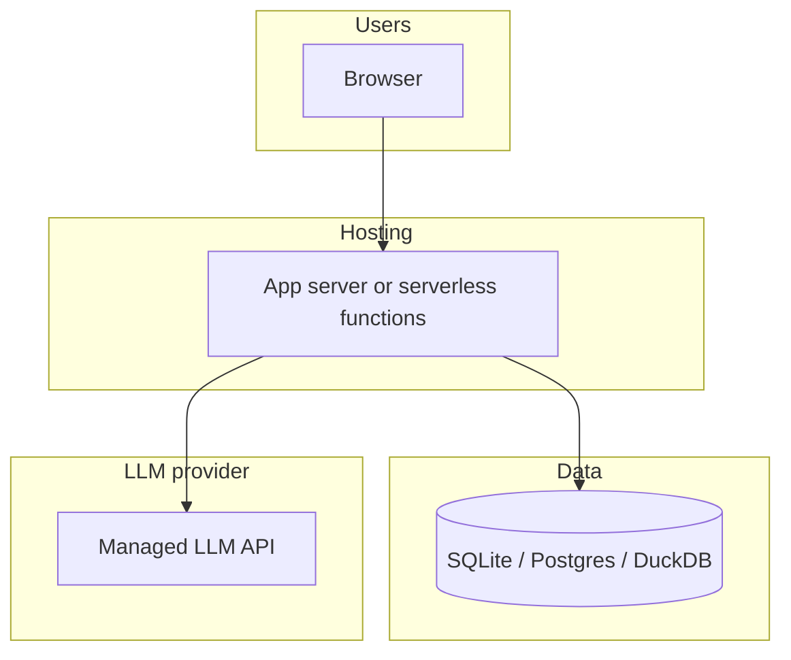

# System architecture: AI-powered restaurant recommendations

This document describes a **reference architecture** for the Zomato-style recommendation service defined in [`context.md`](./context.md). It is technology-agnostic where possible, with concrete options called out for implementation planning.

## 1. Goals and scope

### 1.1 Product goals (from context)

- Combine **structured restaurant data** (Hugging Face Zomato dataset) with an **LLM** for ranking and natural-language explanations.
- Keep **deterministic filtering** separate from **probabilistic** ranking and copy generation.
- **Ground** recommendations in dataset rows passed to the model; minimize invented venues.

### 1.2 In scope

- Dataset ingestion, normalization, and query-by-preferences.
- Orchestration: filter → build prompt → call LLM → merge structured fields with model output.
- User-facing presentation of name, cuisine, rating, cost, and explanation.

### 1.3 Out of scope (unless explicitly added later)

- User accounts, long-term personalization history, or collaborative filtering across users.
- Real-time Zomato API integration (dataset is the source of truth for this project).
- Payment, booking, or maps routing.

---

## 2. Architectural principles

| Principle | Implication |
|-----------|-------------|
| **Grounding** | The LLM only ranks and explains restaurants **present in the candidate list** supplied by the app. |
| **Deterministic filter first** | All hard constraints (location, min rating, budget band, cuisine) are applied in code/SQL **before** the LLM. |
| **Stable identifiers** | Each restaurant row carries a stable `restaurant_id` (from dataset or derived) for joining LLM output back to facts. |
| **Traceability** | Explanations should cite observable attributes; store raw candidate payload for debugging. |
| **Fail-soft UX** | If the LLM fails, return filtered list with template explanations or a clear error—not an empty screen. |

---

## 3. High-level system view



**Request path (happy path):** Client sends preferences → API validates input → orchestrator loads filtered candidates → prompt builder sends structured candidates + user prefs to LLM → validator parses model output, merges with row facts → API returns ranked recommendations with explanations.

---

## 4. Logical components

### 4.1 Client (presentation)

**Responsibilities**

- Collect: location, budget band, cuisine, minimum rating, optional free-text preferences.
- Submit a single “recommend” request (or step wizard if desired).
- Render the **output contract**: name, cuisine, rating, estimated cost, AI explanation; optional summary block.

**Non-responsibilities**

- No business rules for filtering (delegated to backend).
- No direct LLM API keys in the browser for production (use backend proxy).

### 4.2 Recommendation API

**Responsibilities**

- **Input validation**: types, allowed enums (budget), sane bounds on min rating, max length on free-text.
- **Authentication** (optional for coursework): if public, rate-limit by IP or API key.
- **Versioning**: e.g. `POST /v1/recommendations`.
- Map internal errors to stable HTTP codes and client-safe messages.

**Suggested request body (conceptual)**

```json
{
  "location": "Delhi",
  "budget": "medium",
  "cuisine": "Italian",
  "min_rating": 4.0,
  "additional_preferences": "family-friendly, quick service",
  "top_k": 5
}
```

**Suggested response body (conceptual)**

```json
{
  "summary": "Optional short overview of trade-offs.",
  "recommendations": [
    {
      "restaurant_id": "string",
      "name": "string",
      "cuisine": "string",
      "rating": 4.2,
      "estimated_cost": "string or numeric",
      "location": "string",
      "explanation": "AI-generated, user-facing text."
    }
  ],
  "metadata": {
    "candidates_considered": 42,
    "model": "string",
    "latency_ms": 0
  }
}
```

### 4.3 Recommendation orchestrator

**Responsibilities**

- Single entry point for the use case: coordinate filter → LLM → merge.
- Enforce **policy**: max candidates sent to LLM (token budget), max `top_k`, timeouts.
- **Telemetry**: log structured events (candidate count, latency, outcome) without leaking PII.

**Orchestration sequence**

1. Normalize preferences (trim strings, map synonyms for cuisine if configured).
2. Ask data layer for candidates matching hard filters.
3. If zero candidates, return early with helpful message.
4. If candidates exceed cap, **pre-truncate** with a deterministic rule (e.g. highest rating, then shuffle tie-break for variety) before LLM.
5. Build prompt via prompt builder; call LLM with timeout/retries.
6. Validate and merge via response validator.
7. Return final DTO to API layer.

### 4.4 Preference filter and query builder

**Responsibilities**

- Translate `UserPreferences` into a **query** against the dataset store.
- Implement **hard filters**:
  - **Location**: exact city match, normalized city names, or geo radius if lat/long exist in data.
  - **Budget**: map low/medium/high to numeric ranges aligned with dataset `cost` encoding (must be defined during preprocessing).
  - **Cuisine**: substring, multi-label split, or normalized taxonomy table.
  - **Min rating**: `rating >= min_rating` with null-handling policy (exclude or treat as zero).

**Optional**

- **Soft scoring** (still deterministic): boost rows whose text fields match `additional_preferences` keywords; use as sort key before sending top N to LLM.

### 4.5 Dataset store

**Responsibilities**

- Persist **preprocessed** rows for fast read paths.
- Support filter queries by indexed columns (location, cuisine, cost bucket, rating).

**Implementation options**

| Option | When to use |
|--------|-------------|
| **Embedded DB** (SQLite, DuckDB) | Simple deployment, coursework, local demo. |
| **PostgreSQL** | Shared service, concurrent users, richer indexing. |
| **In-memory** (pandas DataFrame) | Prototype only; document memory limits. |

**Ingestion pipeline (offline or startup)**

1. Download/load Hugging Face dataset `ManikaSaini/zomato-restaurant-recommendation`.
2. **Schema mapping**: map raw columns to canonical names (`name`, `city`, `cuisines`, `cost_for_two`, `aggregate_rating`, etc.—exact names depend on dataset).
3. **Cleaning**: parse numbers, handle missing values, dedupe rows if duplicates exist.
4. **Derived fields**: `budget_band`, `cuisine_tokens`, `restaurant_id` if missing.
5. **Load** into chosen store; create indexes on filter columns.

### 4.6 Prompt builder

**Responsibilities**

- Construct a **structured prompt** containing:
  - User preferences (verbatim or normalized).
  - **Candidate list** as JSON or markdown table, each row with `restaurant_id` and only fields needed for ranking/explanation.
  - **Instructions**: rank only from list; output **machine-parseable** format (JSON schema or strict markdown headings) to simplify validation.

**Design notes**

- Keep candidate payload under model context limits; prefer compact tabular JSON over prose.
- Explicitly forbid inventing restaurants; instruct model to use only provided IDs.
- Ask for short explanations (max sentences) to control latency and cost.

### 4.7 LLM client

**Responsibilities**

- Provider abstraction: OpenAI-compatible, Azure OpenAI, Anthropic, or local inference.
- **Configuration**: model name, temperature (low for ranking consistency), max tokens, timeout.
- **Retries**: idempotent retry on transient errors with backoff.
- **Secrets**: API keys from environment or secret manager, never committed.

### 4.8 Response validator and merger

**Responsibilities**

- **Parse** model output (JSON preferred).
- **Validate**:
  - Each returned `restaurant_id` exists in the candidate set.
  - No duplicate IDs in top list unless product allows it.
  - `top_k` respected; pad or trim as needed.
- **Merge**: Attach authoritative fields (name, cuisine, rating, cost) from the datastore row, **not** from the model, to prevent subtle hallucinations in numbers.
- If parsing fails: fallback to deterministic order from filter layer + generic explanation template, and log parse failure.

---

## 5. Data architecture

### 5.1 Canonical entity: Restaurant (logical)

| Field | Purpose |
|-------|---------|
| `restaurant_id` | Stable key for join and validation |
| `name` | Display |
| `city` / `location` | Filter and display |
| `cuisines` | Filter and display |
| `aggregate_rating` | Filter, sort, display |
| `cost_for_two` or equivalent | Map to budget band; display |
| `additional_text` (if present) | Help LLM (ambience, known_for, etc.) |

Exact column names follow the Hugging Face dataset after mapping in ingestion.

### 5.2 Budget mapping

Define a single **source of truth** table in code or DB:

- Numeric cost → `low` | `medium` | `high` bands (document thresholds in README).
- Filtering uses the same mapping the UI uses, avoiding mismatch.

### 5.3 Optional auxiliary tables

- **`city_alias`**: map user input “Bengaluru” ↔ “Bangalore”.
- **`cuisine_alias`**: map “Chinese” ↔ “Chinese, Thai” multi-label rows.

---

## 6. Key flows

### 6.1 Recommendation flow (detailed)



### 6.2 Ingestion / refresh flow

- Trigger: manual script, CI job, or admin endpoint (protected).
- Steps: download → transform → bulk load → swap table or blue-green load.
- Frequency: static coursework dataset may be **once**; production-like systems schedule periodic refresh.

---

## 7. Cross-cutting concerns

### 7.1 Security and privacy

- Do not log raw API keys or full prompts containing secrets.
- Rate-limit public endpoints; validate input size.
- If storing queries, redact or aggregate for analytics.

### 7.2 Reliability

- **Timeouts** on LLM calls (or async job pattern if responses become long).
- **Circuit breaker** optional when provider is degraded.
- **Degraded mode**: structured list only, no LLM.

### 7.3 Observability

- Metrics: request count, p95 latency, LLM token usage, validation failure rate.
- Traces: span per stage (filter, LLM, merge).
- Logs: correlation id per request.

### 7.4 Cost control

- Cap `N` candidates sent to LLM; cap output tokens.
- Cache identical preference queries for a short TTL if appropriate (optional).

### 7.5 Quality and testing

- **Unit tests**: filter mapping, budget bands, merger when LLM returns valid/invalid JSON.
- **Contract tests**: golden files for prompt shape (redacted).
- **Evaluation** (optional): human spot-check explanations against row facts.

---

## 8. Deployment topology (reference)



- **Minimal**: single container or local process + SQLite + one LLM provider.
- **Scaled**: stateless API replicas behind load balancer, managed Postgres, secrets manager.

---

## 9. Extension points

- **Retrieval upgrade**: embeddings + vector search over descriptions for “vibe” matching before LLM ranking.
- **User profiles**: persist history and merge into prompt as soft preferences.
- **A/B testing**: multiple prompt variants behind feature flags.
- **Moderation**: safety filter on user free-text before inclusion in prompts.

---

## 10. Document map

| Document | Role |
|----------|------|
| [`context.md`](./context.md) | Product scope, requirements, output contract |
| [`problemstatement.txt`](./problemstatement.txt) | Original assignment wording |
| **This file** | Component boundaries, flows, data and operational architecture |

---

*Derived from [`context.md`](./context.md); update both when requirements change.*
