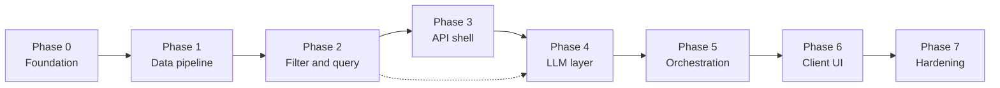

# Phase-wise implementation plan

This plan implements the product defined in [`context.md`](./context.md) according to the reference architecture in [`architecture.md`](./architecture.md). Phases are ordered so each milestone is **demoable**: you always have a vertical slice that can grow toward the full system.

## References

| Document | What to pull from it |
|----------|----------------------|
| [`context.md`](./context.md) | User inputs, output contract, functional requirements, grounding/traceability expectations |
| [`architecture.md`](./architecture.md) | Components (API, orchestrator, filter, store, prompt, LLM client, validator), flows, JSON shapes, cross-cutting concerns |
| [`data-dictionary.md`](./data-dictionary.md) | Phase 1 schema, budget bands, sample SQL |
| [`edge-case.md`](./edge-case.md) | Edge scenarios and policies |

## Assumptions (decide in Phase 0)

Pick and record in the project README:

- **Runtime**: e.g. Python (FastAPI) or Node (Express)—architecture is agnostic.
- **Dataset store**: SQLite or DuckDB for speed of delivery; Postgres if you already require multi-user hosting.
- **LLM provider**: one managed API with env-based API key; no keys in the browser.

---

## Phase dependency overview

Phase 4 can start **after** Phase 2 for local experiments (prompt + merge against a fixture file), but production wiring expects Phase 3’s API boundary.

---

## Phase 0 — Foundation and repository layout

**Goal:** A runnable empty app with configuration, secrets pattern, and module boundaries matching [`architecture.md`](./architecture.md) §3–4.

### Tasks

- Initialize application project (dependency manager, linter/formatter if desired).
- Add `.env.example` with `LLM_API_KEY`, `LLM_MODEL`, `DATABASE_URL` (or path), timeouts—**no real secrets in repo** ([`architecture.md`](./architecture.md) §4.7, §7.1).
- Create packages/modules aligned to components: `api`, `orchestrator`, `filter`, `data`, `llm`, `prompts`, `validation` (names can match your stack).
- Add minimal health endpoint: `GET /health` (or equivalent) for deployment checks ([`architecture.md`](./architecture.md) §8).

### Deliverables

- README: how to install, run, and where configuration lives.
- Document map linking `context.md`, `architecture.md`, this plan.

### Exit criteria

- Project runs locally; environment variables documented; folder structure maps to architecture components.

---

## Phase 1 — Dataset ingestion and canonical schema

**Goal:** Hugging Face dataset loaded, cleaned, and mapped to the **canonical restaurant** shape ([`architecture.md`](./architecture.md) §4.5, §5.1; [`context.md`](./context.md) §Data layer expectations).

### Tasks

- Script or job: load `ManikaSaini/zomato-restaurant-recommendation` ([`context.md`](./context.md) §Source).
- **Schema mapping** from raw columns to canonical fields: `restaurant_id`, `name`, city/location, cuisines, rating, cost, optional text for explanations ([`architecture.md`](./architecture.md) §5.1).
- **Cleaning**: parse numerics, handle null ratings with an explicit policy ([`architecture.md`](./architecture.md) §4.4), dedupe if needed.
- **Derived fields**:
  - `budget_band` from cost using a single documented mapping table ([`architecture.md`](./architecture.md) §5.2; aligns with [`context.md`](./context.md) budget bands).
  - `cuisine_tokens` or normalized cuisine representation for filtering.
- **Persist** to chosen store; create **indexes** on filter columns: location/city, cuisine, budget band, rating ([`architecture.md`](./architecture.md) §4.5).

### Deliverables

- Reproducible ingestion command (e.g. `make ingest` / `python -m scripts.ingest`).
- Short **data dictionary** (which raw column maps to which canonical field; budget thresholds).

### Exit criteria

- Row count and sample queries documented; filters can be run manually against the DB/DataFrame with expected performance on laptop.

---

## Phase 2 — Preference filter and deterministic ranking

**Goal:** Implement the **deterministic filter first** path ([`architecture.md`](./architecture.md) §2, §4.4) covering all explicit user inputs from [`context.md`](./context.md) §User inputs.

### Tasks

- Define internal `UserPreferences` model: location, budget (`low`|`medium`|`high`), cuisine, `min_rating`, optional `additional_preferences` string.
- **Hard filters** in query layer:
  - Location/city match with normalization; optional `city_alias` table or dict ([`architecture.md`](./architecture.md) §5.3).
  - Budget band equality (same mapping as Phase 1).
  - Cuisine: substring or split multi-label field per your data inspection.
  - `rating >= min_rating` with your null policy.
- **Candidate cap**: if results exceed `N_max`, **pre-truncate** deterministically (e.g. sort by rating, tie-break) ([`architecture.md`](./architecture.md) §4.3).
- **Optional soft scoring**: keyword match on `additional_preferences` against description fields for sort only ([`architecture.md`](./architecture.md) §4.4)—still no LLM.

### Deliverables

- Unit tests for budget mapping, cuisine matching edge cases, and “no results” behavior ([`architecture.md`](./architecture.md) §7.5).

### Exit criteria

- Given preferences, function returns a bounded list of `restaurant_id`s + rows for UI fields without any model call.

---

## Phase 3 — Recommendation API (contract-first)

**Goal:** Expose `POST /v1/recommendations` ([`architecture.md`](./architecture.md) §4.2) with strict validation; internally call Phase 2 only and return **stub explanations** (template strings) to unblock UI ([`architecture.md`](./architecture.md) §2 fail-soft direction).

### Tasks

- Request validation: enums for budget, bounds for `min_rating`, max length for free text, default `top_k` with upper cap ([`architecture.md`](./architecture.md) §4.2, §7.4).
- Response DTO matching output contract from [`context.md`](./context.md) §Output contract plus `restaurant_id` and optional `summary` set to null or omitted.
- Map errors to stable HTTP responses (400 validation, 500 unexpected).
- Optional: basic rate limit or API key middleware ([`architecture.md`](./architecture.md) §7.1).

### Deliverables

- Example request/response in README (can mirror [`architecture.md`](./architecture.md) §4.2 samples).

### Exit criteria

- End-to-end **curl** or REST client flow returns filtered restaurants with placeholder explanations and optional `metadata.candidates_considered`.

---

## Phase 4 — LLM integration: prompt, client, parse/validate/merge

**Goal:** Satisfy [`context.md`](./context.md) §Integration layer and §Recommendation engine without yet depending on full orchestrator polish.

### Tasks

- **Prompt builder** ([`architecture.md`](./architecture.md) §4.6):
  - Include normalized user preferences and compact JSON/table of candidates keyed by `restaurant_id`.
  - Instructions: rank **only** from provided IDs; output **machine-parseable JSON** (rank order, per-id explanation, optional summary) ([`context.md`](./context.md) §Integration layer).
- **LLM client** ([`architecture.md`](./architecture.md) §4.7): provider wrapper, low temperature, timeouts, retries, no key logging.
- **Validator / merger** ([`architecture.md`](./architecture.md) §4.8):
  - Parse JSON; reject unknown IDs; dedupe; enforce `top_k`.
  - **Merge authoritative fields** from datastore rows, not model output, for name/cuisine/rating/cost ([`context.md`](./context.md) traceability/grounding).

### Deliverables

- Golden test or snapshot for **prompt shape** (redact keys) ([`architecture.md`](./architecture.md) §7.5).
- Tests for merger with valid JSON, malformed JSON, and hallucinated ID handling.

### Exit criteria

- Given a fixed candidate fixture + mocked LLM response, merger returns correct final DTO.

---

## Phase 5 — Recommendation orchestrator and fail-soft behavior

**Goal:** Single coordinated path as in [`architecture.md`](./architecture.md) §4.3 and sequence §6.1.

### Tasks

- Orchestrator steps: normalize prefs → filter → empty-state message → cap → prompt → LLM → validate/merge → return ([`architecture.md`](./architecture.md) §4.3).
- **Degraded mode** ([`architecture.md`](./architecture.md) §7.2): on LLM timeout/parse failure, return deterministic list + template explanation; log failure reason ([`architecture.md`](./architecture.md) §4.8).
- **Telemetry hooks** ([`architecture.md`](./architecture.md) §7.3): timing per stage, candidate count, validation failures; correlation id on logs.
- Wire orchestrator behind Phase 3 API (replace stubs).

### Deliverables

- Documented behavior matrix: success, zero candidates, LLM error, parse error.

### Exit criteria

- API matches [`context.md`](./context.md) functional requirements 1–3 end-to-end; failures still return usable JSON where possible.

---

## Phase 6 — Client presentation

**Goal:** Meet [`context.md`](./context.md) functional requirement 4 and output contract in a **user-friendly** layout ([`context.md`](./context.md) §Output contract).

### Tasks

- Form fields for all inputs in [`context.md`](./context.md) §User inputs.
- Call backend only (no browser-stored LLM keys) ([`architecture.md`](./architecture.md) §4.1).
- Results UI: cards or list with name, cuisine, rating, estimated cost, explanation; optional summary when present ([`context.md`](./context.md) §Recommendation engine).
- Loading and error states; empty results copy aligned with orchestrator messages.

### Deliverables

- Screenshots or short demo GIF in README (optional but useful for reviewers).

### Exit criteria

- Non-technical user can complete a session without seeing raw JSON or stack traces.

---

## Phase 7 — Hardening, quality, and deployment

**Goal:** Cross-cutting concerns from [`architecture.md`](./architecture.md) §7 and deployment §8.

### Tasks

- **Cost control**: enforce `N_max` and output token limits; document typical spend ([`architecture.md`](./architecture.md) §7.4).
- **Security**: input size limits, redact logs, dependency audit if applicable ([`architecture.md`](./architecture.md) §7.1).
- **Reliability**: tune timeouts; optional circuit breaker ([`architecture.md`](./architecture.md) §7.2).
- **Deployment**: minimal topology (app + DB + provider) with env-based config ([`architecture.md`](./architecture.md) §8).
- **Regression tests**: critical paths from Phase 2 merger tests + a few integration tests against test DB ([`architecture.md`](./architecture.md) §7.5).

### Exit criteria

- Repeatable deploy/run instructions; known limits documented; system behaves predictably under LLM failure.

---

## Phase 8 (optional) — Extensions

Only after core phases meet [`context.md`](./context.md) requirements.

| Extension | Reference |
|-----------|-----------|
| Embeddings / vector retrieval for “vibe” | [`architecture.md`](./architecture.md) §9 |
| Optional `summary` polish and prompt A/B | [`context.md`](./context.md) §Recommendation engine; [`architecture.md`](./architecture.md) §9 |
| Moderation on free-text preferences | [`architecture.md`](./architecture.md) §9 |
| Caching identical queries | [`architecture.md`](./architecture.md) §7.4 |

---

## Traceability matrix (requirements → phases)

| Requirement / contract ([`context.md`](./context.md)) | Primary phases |
|--------------------------------------------------------|----------------|
| Hugging Face ingest + preprocess | 1 |
| Filter by preferences | 2 |
| Structured payload + LLM rank/explain | 4, 5 |
| Output fields + usable UI | 3, 6 |
| Grounding + authoritative merge | 4, 5 |
| Separation filter vs LLM | 2 vs 4–5 |

---

## Milestone demos (suggested checkpoints)

| After phase | Demo you can show |
|-------------|-------------------|
| 2 | CLI or notebook: preferences → filtered table |
| 3 | API returns JSON with real rows + stub text |
| 5 | Same API with real explanations + degraded mode |
| 6 | Full user journey in the browser |
| 7 | Hosted or containerized demo with env config |

---

*Aligned with [`context.md`](./context.md) and [`architecture.md`](./architecture.md); revise phase boundaries when you lock a specific tech stack.*
